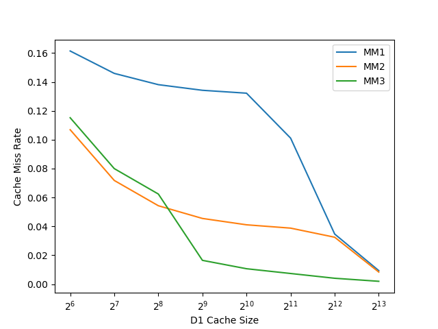

# Exercise 2: Matrix Multiply Exploration

The graph below was generated by running the varycachesize script on the range
of 64-8192 bytes for MM 1, 2 and 3.



## Quantitative Analysis of the Results

As one can see in the diagram above, the MM1 performs the worst in terms of the
cache miss rate among all of the other implementations. Another interesting
observation is that although MM3 started off slightly worse than MM2 for the
ranges of the cache size up to 128B, then its performance has drastically
improved and remained considerably smaller than the one of all other
implementations.

Another interesting insight is that in case of all implementations, the number
of cache misses falls down to virtually 0 when the cache size is increased to
8192 bytes. That could suggest that whatever we are doing in those algorithms,
with the cache size of 2^13 bytes, it is likely that all of the data can fit
into the cache and there are no associativity conflicts.

In the next section I will analyze the C implementation of all of these
algorithms and see how it might contribute to the differences in the rate of
cache misses across different implementations.

## Impact of the Implementation on the Rate of Cache Misses.

### MM1 Implementation

```
void mm1(A,B,C)
     FLOATTYPE A[SZ][SZ], B[SZ][SZ], C[SZ][SZ];
{
  int i, j, k;

  for (i = 0; i < SZ; i++){
    for (j = 0; j < SZ; j++){
      for (k = 0; k < SZ; k++){
	C[i][j] += A[i][k] * B[k][j];
      }
    }
  }
}

```

The reason why this one has a lot of cache misses is similar to the associativity
conflicts in the example given in the lectures. What happens is that the matrices
are allocated on the stack one next to the other:
```
FLOATTYPE A[SZ][SZ];
/* int pad1[1]; */
FLOATTYPE B[SZ][SZ];
/* int pad2[1]; */
FLOATTYPE C[SZ][SZ];
```
And for matrix multiplication in every loop iteration we access A[i][k] * B[k][j]
TODO: do the calculations to see that the index bits into the cache are the same
(or same with the ones that were used in previous iterations) and so we are
dealing with associativity conflicts.


